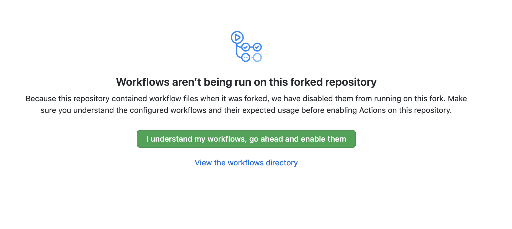

# 模版库构建

## Markdown-ECNU-F0RE1GNERS

我们在初步研究 ECNU F0RE1GNERS template master 分支下构建模版的方法后，发现：

- 他们使用了 GitHub Actions 配合若干脚本，实现了自动化构建。
- 源文件采用 Markdown 编写，在本地编写源码文件, 实时渲染所需的门槛非常低，只要能够渲染 Markdown 就可以。

使用指北(以下教程基于 Fork 我们的 [repo][template-markdown-ecnu-f0re1gners-repo], 如果你 Fork 的是原仓库，可能需要改动 `main.yml`)：

- Fork 我们的 [repo][template-markdown-ecnu-f0re1gners-repo]。
- 修改源码文件，如果要增加新的模块，请按照 `*-*.md` 格式进行命名，第一个 `*` 表示序号。
- 如果要修改封面，请修改 `pandoc/algo.latex` 文件，如果是简单的修改队名和校名，可以快速定位到 378 行修改以下内容：
  ```plain
  \title{\vspace{50mm} \huge Standard Code Library \\[20pt]}
  \author{Your TeamName \\[10pt] Your School}
  \date{\today}
  ```
- 提交源码。
- GitHub Actions 会自动构建，并且会将构建产物 `template.pdf` 推送到 gh-pages 分支下。

???+ danger "开启 Actions"
    需要注意的是，如果你 fork 了一个配置了 Github Actions 的仓库，你 fork 的仓库并不会自动触发 Github Actions，需要点击 Actions 页面进行开启。

    

## LaTeX-ECNU-F0RE1GNERS

如果你想用 LaTeX 编写你的模版，我们参考ECNU F0RE1GNERS template wf-tex 分支下的代码，编写了 GitHub Actions workflow 文件，能够进行自动化构建。

虽然我们觉得这种方案通用性不是很高，因为如果你能够熟练使用 LaTeX 的话，那么你在本地肯定能够编译 LaTeX。如果你用了别的 package，或者别的 font，这个 `workflow` 文件也不一定适用了。

但是我觉得还是能够提供一定参考的，如果你想快速的构建自己的模版，不需要本地实时预览，或者不想在本地配置 LaTeX 环境，那么这个方案也是一个不错的选择。

使用指北(以下教程基于 Fork 我们的 [repo][template-latex-ecnu-f0re1gners-repo], 如果你 Fork 的是原仓库，可能需要改动 `main.yml`)：

- Fork 我们的 [repo][template-latex-ecnu-f0re1gners-repo]。
- 可以在 `main.tex` 中修改封面。
- 在 `cheatsheat.tex` 中编写一些备忘录，譬如数学公式等。
- 可以将源码文件放在 `assets` 目录下，然后在 `contens.tex` 中进行引入。
- 然后提交代码，就会自动编译并推送的到 `gh-pages` 分支下。

==注意：同样需要开启 Actions。==

[template-markdown-ecnu-f0re1gners-repo]: https://github.com/XCPCIO/template-Markdown-ECNU-F0RE1GNERS
[template-latex-ecnu-f0re1gners-repo]: https://github.com/XCPCIO/template-LaTeX-ECNU-F0RE1GNERS
